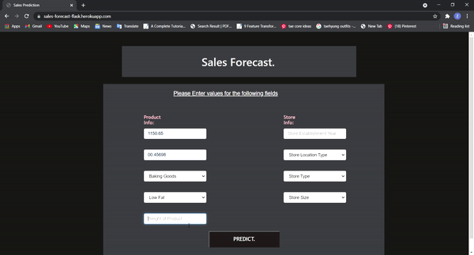

# Sales-Forecast
A sales forecast is a prediction of future sales revenue. Sales forecasts are usually based on historical data, industry trends, and the status of the current sales pipeline. Businesses use the sales forecast to estimate weekly, monthly, quarterly, and annual sales totals. 

Deployment mode : Heroku
link : https://sales-forecast-flask.herokuapp.com/

 

Video :
 

 

# Project Overview.

- Predicting Sales for Big Mart.
- Building using Random Forest Regressor
- Save and deploy 
# Project Structure.

- Importing Data
    
    - Importing Libraries 
    - Imputing missing values
    
    
- Exploratory Data Analysis
    - Univariate Analysis.
    
- Data Handling.
    - Data Preprocessing
    - Train Test split
    - Data Scaling
    
- Machine Learning Algorithms 
    - Random Forest
    

- Fitting model

- Saving as pickle file

- Trying on Test Data

THANK YOU!
